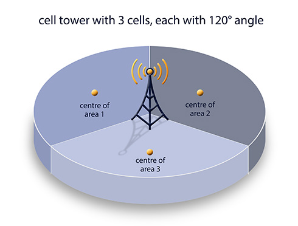
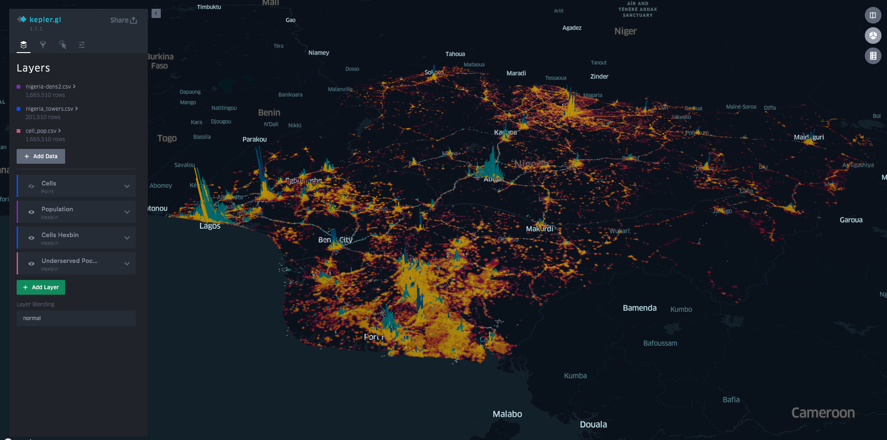
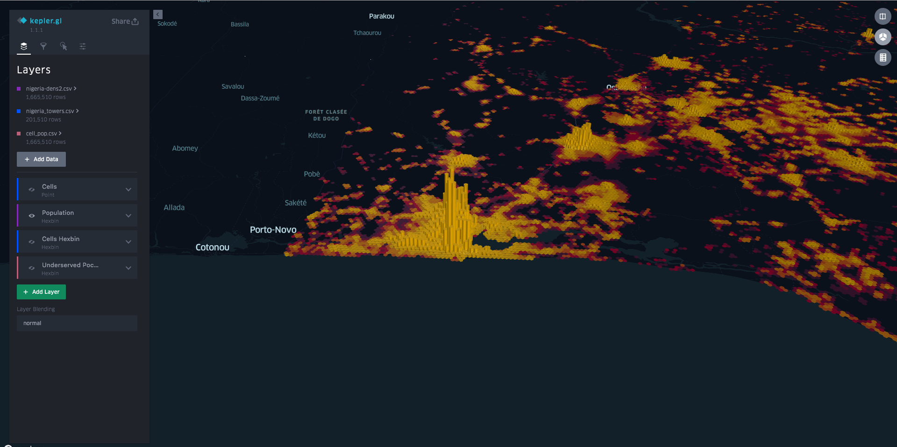
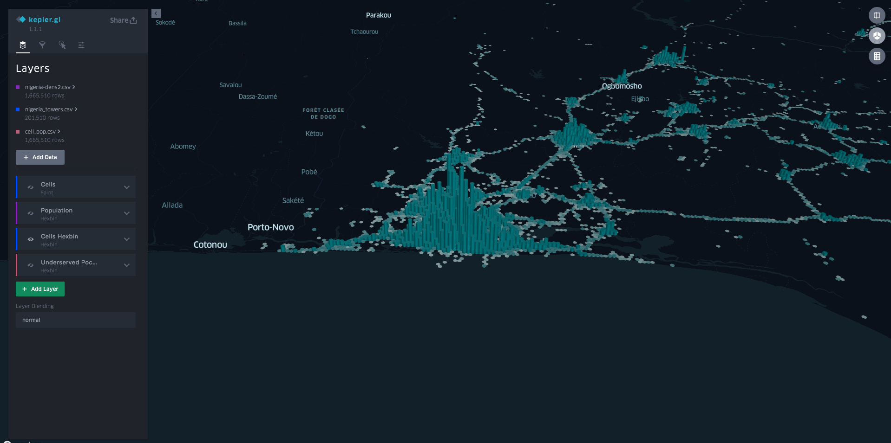
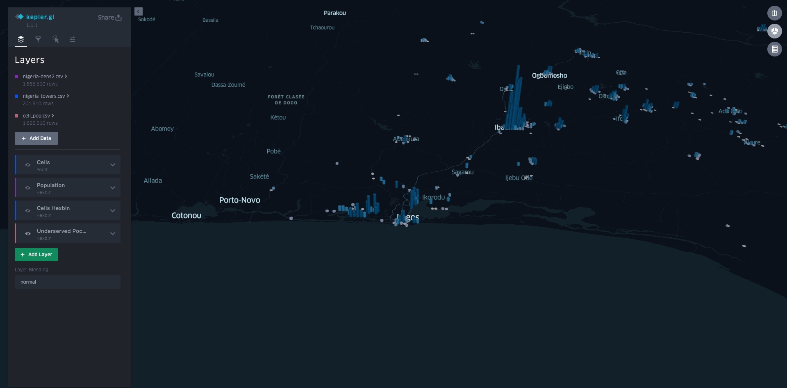

# Visualization of Telecom Cell Coverage vs Population Density in Nigeria 

This demo has been developed to showcase the visualization of cell coverage when compared with population density. 

## Data

I'm using open data from two separate sources:

* Nigeria Population Density. Source: [WorldPop](https://energydata.info/dataset/nigeria-population-density-2015)
* OpenCellID Cell Readings. Source: [Unwired Labs OpenCellid](http://opencellid.org/downloads.php)

Please note that OpenCelliD Project is licensed under a Creative Commons Attribution-ShareAlike 4.0 International License. OpenCellid's FAQ is [here](http://wiki.opencellid.org/wiki/FAQ).

## Methodology

Population density data downloaded from WorldPop was in raster format. Each pixel representated a 100 meter resolution. This means a 100mx100m grid over the whole country, with the value representing the number of people residing in that 100mx100m area. A Python script was developed to extract these values, and then to aggregate them into a Uber's [H3 addressing](https://eng.uber.com/h3/), with Hexbins of 1Km radius.

For OpenCellId, a full database of network readings could be downloaded from their website. The database does not have the exact location of the cell's base station or active equipment, but rather, as it is illustrated below, the readings can be used to estimate them. For now, readings density was calculated, and were binned into similar size Hexbins as the population.

## Layers

Through data processing, there are now 3 layers:

* Population Density
* Cell Coverage
* Underserved Pockets of Coverage

The third layer was just computed using a simple ratio of population density over cell coverage, using H3 binned values.

## Visualization

Once all data is processed, then [Kepler](https://kepler.gl/demo) could be used to visualize the data, especially that now data is now [H3](https://eng.uber.com/h3/)-addressed, which is an addressing scheme devised by Uber.

The below is the map combining all layers.

The below is the map, zoomed on Lagos, showing the population layer:

The below is the map, zoomed on Lagos, showing cell coverage:

The below is the map, zoomed on Lagos, showing underserved areas:

Just from looking at this map, the Ibadan area north of Lagos seems to have some underserved area. This is of course not a firm conclusion. It could be the case of just the lack of readings in the crowdsourced OpenCellid data. Or maybe some economic reason, where the population living in this area might not be able to afford mobile phones and Telecom fees.

## Future Work: Advanced Data Processing

No advanced data processing has been done on these datasets yet. They have been used only for visualization for now, but this could be the basis for many in-depth analysis and insights.

Cell power readings has not been taken into account. I wanted to show cell coverage vs population, and not cell network performance. 

The cells could be classified by operator, or by certain target area. A benchmark between operators could be established, by creating KPIs to calculate network level of service per capita, or by area. 

Please keep in mind that this network performance data is crowd-sourced, and so cannot be used for calculating performance with precision, but just to get a rough idea about cell coverage. 

## License

The contents of this repository are covered under the MIT License.